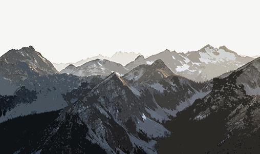

# MST Based Image Segmentation

A simple image segmentation, applied to make a [cutout](https://helpx.adobe.com/photoshop/using/filter-effects-reference.html) filter.

## Usage

```
python3 cutout.py input.jpg output.jpg <TRESHOLD> <RADIUS>
```

## Result

Original | Result
---------|---------
 | 
 | 
 | 
 | 

## Photo source

* [house](http://www.palmatin.com/wp-content/uploads/2013/06/painted-square-log-house1.jpg)
* [mountains](https://static.pexels.com/photos/15382/pexels-photo.jpg)
* [balloon](https://i.ytimg.com/vi/7_Y3QFdmpHw/maxresdefault.jpg)
* [flower](https://static.pexels.com/photos/36753/flower-purple-lical-blosso.jpg)